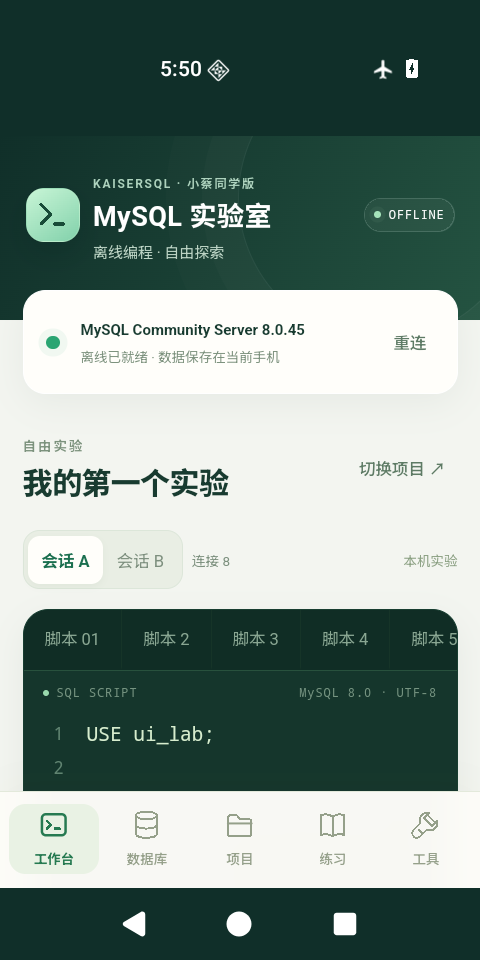
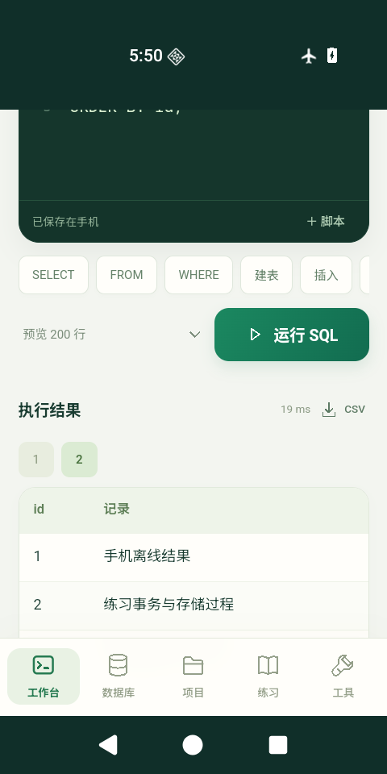
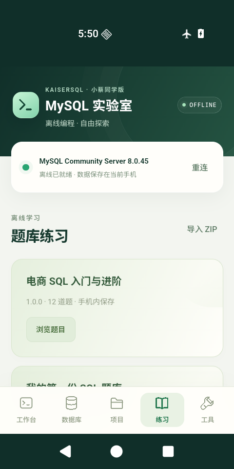

<p align="center"></p>

# KaiserSQL · 安卓离线 MySQL 实验室

**小蔡同学版**：在安卓手机上自由建库、建表、存数据和编写 SQL。内置真实 **MySQL Community Server 8.0.45**，同时提供题库练习与本机判题。

安装包取得并安装后，首次启动与日常使用都可断网完成。无需 App 登录、服务器、域名、电脑后台或同一 Wi-Fi；每台手机分别保存自己的实验。

当前版本：**0.3.1-offline 测试版**。支持 Android 8.0 及以上的 ARM64 手机，另提供 x86_64 模拟器构建。ARM64 包已构建，真机兼容性仍待验证。

## 能做什么

| 功能 | 当前能力 |
|---|---|
| 自由实验 | 自行建库、建表、写入中文与数字数据，执行查询、修改与删除，不绑定固定题目 |
| 数据库编程 | 视图、索引、事务、存储过程、函数、触发器、游标，以及 MySQL 用户和角色实验 |
| 双会话 | A/B 两条本机连接，用于事务、变量、临时表和锁实验 |
| 独立项目 | 每个项目使用独立 MySQL 数据目录；保留已提交数据、草稿与执行历史 |
| 题库学习 | 内置 12 道示例题；导入 ZIP 题库，在本机使用独立初始数据判题 |
| 导入导出 | SQL 文件、数据文件导入；当前脚本、结果 CSV 与项目 SQL 备份导出 |
| 手机界面 | 多标签、行号、SQL 快捷键、键盘适配、启动插画与轻量动效 |

本项目按 MySQL 8.0.45 的实际语法和行为运行，不承诺复刻全部版本、全部插件及外部开发工具。当前没有 Python/Java 用户代码运行环境、E-R 绘图、云同步、在线班级后台或 iPhone 离线包。事件仅在引擎运行时执行。

## 看看界面

<p>




</p>

## 开始使用

普通使用不需要搭建后台。获取 ARM64 离线 APK，在手机安装后等待“离线已就绪”，即可在工作台运行下面的实验。若 Release 尚未提供 APK，可按[构建说明](docs/BUILD.md)自行构建。

```sql
CREATE DATABASE IF NOT EXISTS my_lab CHARACTER SET utf8mb4;
USE my_lab;
CREATE TABLE IF NOT EXISTS notes (
  id INT PRIMARY KEY AUTO_INCREMENT,
  content VARCHAR(200) NOT NULL
);
INSERT INTO notes(content) VALUES ('我的第一次手机 SQL 实验');
SELECT * FROM notes ORDER BY id;
```

建议至少预留 1 GB 空间，新的独立项目会增加磁盘占用。默认自动提交的写入会保存；显式事务需要 `COMMIT`。切换项目、重连或结束进程会回滚未提交事务，草稿自动保存不等于数据库事务提交。

结果预览可选 200/1000/5000 行，最多约 4 MB；CSV 只包含已经显示的结果。完整实验请使用“导出项目脚本”备份。数据库用户、授权和角色，以及草稿、历史、题库完成标记不包含在项目 SQL 备份内。

## 手册与题库

- [20 页新手手册 PDF](docs/manual/KaiserSQL_APP功能介绍与使用说明_0.3.1.pdf)
- [可编辑 Word 手册](docs/manual/KaiserSQL_APP功能介绍与使用说明_0.3.1.docx)
- [适合发给同学的介绍单页](docs/manual/KaiserSQL_给同学的产品介绍_0.3.1.pdf)
- [8 个 SQL 示例](examples/sql/)
- [Excel 题库模板与可导入示例 ZIP](examples/question-bank/)
- [题库制作说明](docs/QUESTION_BANK.md)

题库导入到手机本地。参考答案与解析可以查看，适合练习和学习；没有隐藏答案考试或老师后台汇总。完成标记保存在当前手机。

## 开发者入口

- [构建与重建](docs/BUILD.md)
- [运行架构](docs/ARCHITECTURE.md)
- [验证范围](docs/VERIFICATION.md)
- [贡献说明](CONTRIBUTING.md)
- [第三方许可及源码来源](THIRD_PARTY_NOTICES.md)

源码目录：`mobile-lab/` 是手机界面，`android/` 是原生桥接与 MySQL 执行层，`seed/` 是教学数据，`scripts/` 负责构建和固定版本运行时准备。此公开目录聚焦离线版，早期联网后台与个人运行数据未纳入。

本项目新增代码采用 [MIT](LICENSE) 许可。MySQL、PRoot、Oracle Linux 用户空间和其他第三方组件各自保留原许可证；项目 MIT 许可不改变这些组件的许可。
