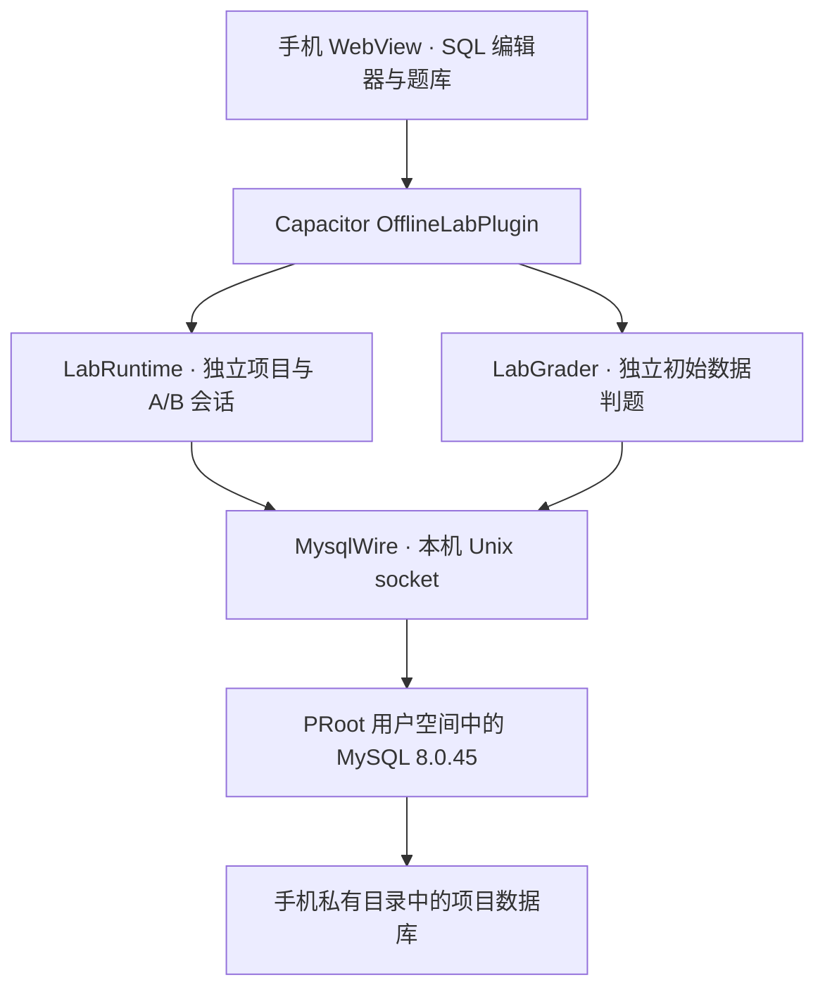

# 离线运行架构

APK 包含引擎文件，首次启动将其解压到应用私有空间。每个项目有独立 MySQL 数据目录，同一时刻打开一个项目。A/B 两条连接共享该项目的数据，各自维护数据库选择、变量、临时表和事务。

`MysqlWire` 实现 MySQL 协议客户端。连接使用本机 Unix socket，MySQL 以 `--skip-networking` 启动。离线 flavor 删除 INTERNET 和 ACCESS_NETWORK_STATE 权限。

`SqlScript` 处理多语句与 DELIMITER。运行选中片段或整个标签；遇到错误停止后续语句，已经提交的写入仍会保留。取消调用 KILL QUERY，不等同于撤销已提交操作。

题库在手机导入。判题时为学生脚本和参考答案分别准备独立的初始数据与受限用户；数据修改和建表题通过只读检查 SQL 比较状态。练习工作项目可复用，判题数据每次重新准备。

项目导出调用内置 mysqldump，包含用户数据库及视图、触发器、存储程序和事件。用户、授权、角色以及编辑器与题库元数据需要另行保存。事件仅在引擎运行时触发，不保证 App 被停止后的后台调度。
